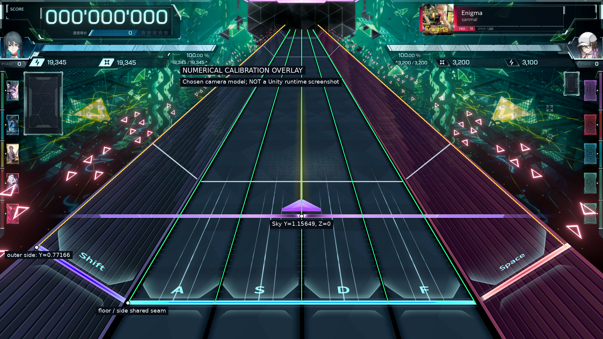
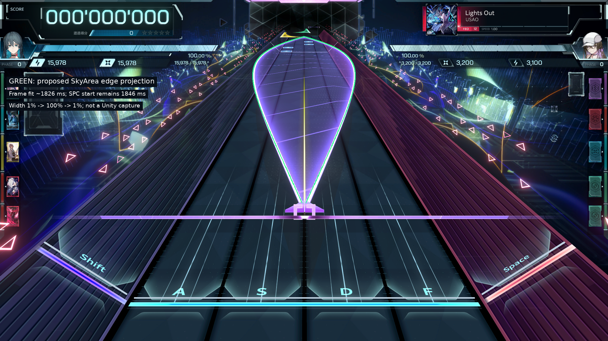
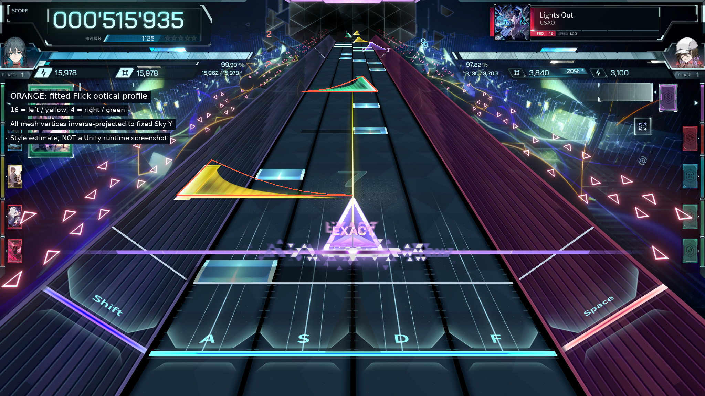

# 历史版本存档：0.1（不是0.2规范）

特别是Flick按宽高比计算、缺少交互、行号ID等说明已被0.2替代。当前规则以DESIGN_MANUAL.md与EDITING_GUIDE_0.2.md为准。

# InFalsus Studio 0.1：相机、场地与谱面几何设计手册

**目标：Unity 中可继续开发的三维制谱基础。日期：2026-09-21。**

本手册区分三类结论：**源码／文件事实**、**本版采用的建模约定**、**仍需对照验证的外观或规则**。不要把拟合出的 Unity 相机参数当成反编译得到的游戏原值，也不要把数学参考测试当成 Unity 编译通过。

## 1. 输入材料与可追溯基线

使用材料：用户提供的 `无note时截图.png`、`Lights Out最开头.png`、`Lights Out最开头2.png`、`Infalsus游戏内实际录制.mp4`、`Forbidden_lightsout3（非二进制）.spc`，以及错误效果 `lightsout_t5500.png`。

图像参考为 2048×1152。录屏为 1920×1080、30 fps、约 26.47 秒。检查了多个时刻及首个 Tap／Flick 附近的逐帧样本；未逐帧验证整段录屏全部音符。截图中 SPEED=1.00，录屏中 SPEED=4.50，不能混用同一个时间—距离比例比较。

SPC 全文审计：1138 行；`chart` 1、`tap` 600、`hold` 26、`flick` 304、`skyarea` 190、`track` 17；1120 个音符对象（把一个 SkyArea 段算一个对象，不是官方计分数量）。本文件没有 `bpm/lane/beam` 事件。最后一个音符结束时间为 143538 ms。

原文件 SHA-256：

```
166a8abf158c8e2ccdebac0b2ee897b371f569b0ae4cdbcc7bbd6709ea41aa7e
```

上游参考固定于 `yuhao7370/In_Falsus_Editor` 的 `d61cd73395ebe6959358f2f5669ba9cf259eadeb`。本次 C# 实现为新的 Unity 结构，不把其二维像素尺寸直接当三维世界高度。

## 2. 不能再混淆的坐标契约

```
世界 X：横向，右为正
世界 Y：高度，上为正
世界 Z：谱面纵深，远方／未来为正
地面判定：Y=0, Z=0
空域判定：Y=skyHeight, Z=0
相机：位于负 Z，向正 Z 看，绕 X 向下俯视
中央四轨：X ∈ [-2,2]，每轨一个世界单位
```

`StageSpace.cs` 是坐标的唯一来源。侧轨、地键、轨道边线和拾取都应使用同一套映射。场景启动根节点保持单位变换；不得把它挂到有旋转或非等比缩放的父对象下面后，再通过改相机掩盖几何错误。

### 2.1 六条轨道不是六张悬浮的 Plane

中央 lane 1～4 是同一水平地面的四个区间。lane 0 和 lane 5 分别是左、右斜面，与中央地面的 `x=-2`、`x=2` 边界共用接缝。两侧都向外升高，不是一侧正旋转、一侧负旋转以后任意平移。

取 `run=0.8252873`、`rise=0.7716634`：

```
left(u,z)  = (-2-run*(1-u), rise*(1-u), z), u∈[0,1]
right(u,z) = ( 2+run*u,     rise*u,     z), u∈[0,1]
```

所以左侧 `u=1`、右侧 `u=0` 恰好接到 Y=0；沿全部 Z 都成立。外侧分别是 X=±2.8252873、Y=0.7716634。相当于向外倾约 43.08°，但实现直接写顶点，不通过“旋转 Unity Plane”构造。

薄线／键面使用几百分之一世界单位的法向偏移避免深度冲突。这个美术偏移不是把整个侧轨抬离地面。

## 3. 相机是怎样定下来的

单幅截图无法唯一确定真实焦距、世界尺度和相机距离。本版主动选定中央一轨宽=1、垂直 FOV=50°，再根据空场截图拟合其余几何。相机模型采用普通透视，不使用拼贴背景、假轨道或自定义歪斜投影矩阵。

### 3.1 锁定参数

| 参数 | 本版值 | 属性 |
|---|---:|---|
| 垂直 FOV | 50° | 主动选定的尺度约定，不是原游戏已知值 |
| Camera position | `(0,3.086448,-3.219452)` | 图像拟合的等价模型 |
| Camera Euler | `(23.65212,0,0)` | 正 X 俯视；禁止追加 roll/yaw |
| 中央总宽 | 4 | 约定 |
| 空域高度 | 1.156494 | 与空域判定线位置一起拟合 |
| 侧轨 run / rise | 0.8252873 / 0.7716634 | 与侧轨端点位置一起拟合 |
| 地面／空域判定 Z | 都为 0 | 同一时刻，不同高度 |
| 视图宽高比 | 16:9 | 默认锁定，非 16:9 用留边处理 |
| SPEED=1 的距离系数 | 约 15 世界单位/秒 | 用前几个 Tap 的间距估计，仍可校准 |

Unity 的 `Camera.fieldOfView` 使用角度；不要把上一个 Rust 后端的弧度设置照搬过来。

### 3.2 校准锚点

下表使用图片左上角为原点的 2048×1152 像素坐标。截图手工估计中心约 1025 px，本版选择严格左右对称的 1024 px，因此故意存在约 1 px 的偏差；不能将此说成精密恢复了原生相机。

| 锚点 | 世界点 | 本版投影 |
|---|---|---|
| 地面判定左端 | `(-2,0,0)` | `(434,1029)` |
| 地面判定右端 | `(2,0,0)` | `(1614,1029)` |
| 空域判定中心 | `(0,skyHeight,0)` | `(1024,734)` |
| 左侧外端 | `(-2-run,rise,0)` | `(124,840)` |
| 右侧外端 | `(2+run,rise,0)` | `(1924,840)` |
| 纵深消失行 | `Z→∞` | y≈35 |

`CameraCalibration.cs` 是独立的双精度推导；`StageSpace.ApplyCamera` 把参数应用到 Unity；菜单 `Check Running Camera Landmarks` 则在用户实际 Unity 相机里检查投影，容差为 2.5 px 等效尺寸。后者尚未在本次环境运行。



### 3.3 改窗口尺寸时别改谱面几何

`WorldToScreenPoint`、`ScreenPointToRay` 与相机 pixelRect 必须保持一致。IMGUI 的 Y 向下，Unity 屏幕像素 Y 向上，拾取时要转换。未锁 16:9 的宽视口会展示更多横向内容；不能为了填满某个编辑面板，拉伸世界 X 或给侧轨添加旋转。

本版主场景占 Game 视口，编辑控件叠加在上方。后续改成 RenderTexture 面板时，应把相机 aspect、坐标原点和拾取偏移一起迁移。

## 4. 文件层：不能把显示结构当成保存结构

`.spc` 是逐行调用式文本，不是三维模型。`SpcDocument` 保留每行文本、单独的换行格式、UTF-8 BOM，以及未知调用和额外参数。未编辑内容不重新格式化；数值属性修改仅替换被修改的 token。

```
tap(time_ms,width,lane)
hold(time_ms,lane,width,duration_ms)
flick(time_ms,center_x,x_split,width,direction)
skyarea(time_ms,sx,ss,sw,ex,es,ew,leftEase,rightEase,duration_ms[,group])
```

**Tap 与 Hold 的 lane/width 顺序不同。** 每个事件 SourceId 是文档行号索引，不是时间排序后的数组位置。删除行之后索引会变，当前初版会清理选择；后续多选／拖拽宜补稳定文档 ID，不可直接把时间排序索引当原始行号。

全部 `track` 要在读完全文后建立时间轴。这张谱面的 track 恰好在文件最后 17 行；边读音符边渲染、只读取开头几十行会错过 22154 ms 起的减速。

未识别事件／编码保留原文本并提示，不擅自改成 Linear 或 Right。`Beam`、未知事件、`bpm` 保留字段、`lane` 的本体行为均没有在此版完成可视化语义验证。源文件中的它们不会因为不显示而被删除。

保存采用另存副本，不允许直接覆盖加载的源文件。退出 Play 或加载另一张谱面之前，尚未保存的修改尝试写入 `Application.persistentDataPath/Recovery/`；这是尽力恢复副本，不等于崩溃安全的持续自动保存。

## 5. Tap 与 Hold：宽度、位置、侧轨绑定

lane 0/5 只允许单宽；中央 lane 1→最大4、2→最大3、3→最大2、4→最大1。lane 是最左侧起始轨，不是中心轨。覆盖逻辑区间为 `[lane,lane+width)`。

```
tap(1000,4,1)       # 占全部中央四轨
hold(1000,2,3,500)  # 占 lane 2、3、4，从1000到1500 ms
```

`tapWidthRatio=.94` 只是绘图留边；不能把它写入 width。Tap 使用扁平、带渐变和亮边的短板；Hold 使用同一覆盖区间沿时间展开，条身须在 track 变化点插入截面。侧轨 Tap/Hold 直接使用 `StageSpace.FloorBound`，自然服从斜面。

持续中的 Hold 裁去已过去时间部分，但不改变原文件 time/duration。已完成音符按时间隐藏，而非看到 Z<0 就判定完成。本版不实现“覆盖任意一个物理键可否击中”等实际游戏判定。

## 6. SkyArea：两条边界，而非一条固定宽中心曲线

### 6.1 各自归一化起止坐标

```
Cs = startX / startSplit; Ws = abs(startWidth / startSplit)
Ce = endX   / endSplit;   We = abs(endWidth   / endSplit)
Ls = Cs-Ws/2; Rs = Cs+Ws/2
Le = Ce-We/2; Re = Ce+We/2
```

X 是中心；split 是横向分割尺度，不是轨道数量、空域高度、Y 坐标或“第几条空中轨”。归一化 [0,1] 对应中央四轨整体，映射为 `X=4*(xNorm-.5)`，不包含两侧轨。

### 6.2 原始时间控制缓动

```
u = clamp((time-timeStart)/duration,0,1)
E0(u)=u
E1(u)=sin(pi*u/2)       # SineOut
E2(u)=1-cos(pi*u/2)     # SineIn
L(u)=Ls+(Le-Ls)*E_left(u)
R(u)=Rs+(Re-Rs)*E_right(u)
```

最后才得到中心 `(L+R)/2` 和宽度 `R-L`。左右缓动独立，有 9 种组合；不要先插值中心，再强行维持初始宽度。不得用头尾投影高度的百分比代替 u；跨变速时那样一定会改变形状。

### 6.3 本次开头就是最好的回归样本

```
skyarea(1846,100,200,2,1,2,2,1,1,923,0)
skyarea(2769,1,2,2,100,200,2,2,2,923,0)
```

首段：1846→2769 ms，中心 .5，宽度 `.01→1`，左右 SineOut。次段：2769→3692 ms，中心 .5，宽度 `1→.01`，左右 SineIn。这里 `.01` 是真实 1%，不能照上游某些显示辅助代码设一个 5% 最小值。窄端也不等于零宽。

开头截图的窄端尚略在空域判定线之前。因此增加 **Opening ~1826** 的近似截图对照预设；**1846 仍然是文件规定的开始时间**。1826 是图像拟合的播放头估计，不能把它作为谱面时间修改或全曲 audio offset。



### 6.4 网格生成

每个时间采样点产生 `L(t)` 和 `R(t)` 两个顶点，Y固定在空域层，Z来自滚速积分。相邻截面组成两三角形。采样强制包含头尾、当前时间裁剪点及内部 track 变化点，再根据屏幕投影误差／时间和世界长度上限细分，不固定为20段。

原始 `t0` 一直保留。播放进入条身后，只把绘图起点挪到 now；不能让剩余曲线重新从 u=0 开始。

`group_id` 被保留但不改变高度、颜色或曲率。本版相接两段按几何自然连续；没有伪造“同 group 自动判定／合并网格”的本体语义。非原生曲线分段也不能简单复制同一个 ease，声称能保持任意切点前后的曲线完全相同。

中间左右交叉时，本版不交换数据：跳过检测到的倒置绘制片段并计数。这不是完备的连续最小宽度验证器，后续需要解析式／数值极值校验和明确诊断。

## 7. Flick：最容易再次被错误实现的部分

### 7.1 方向约定不能按尖端猜

- 16：向左，黄色；粗／高的端帽在左，薄尾向右。
- 4：向右，绿色；粗／高的端帽在右，薄尾向左。

尖细尾巴所指方向不是输入方向。首个 Flick `flick(3692,6,24,12,16)` 的中心=.25、宽=.5，逻辑覆盖中央左半区域；第二个 `flick(4154,10,24,12,4)` 的方向为右，中心=10/24。

### 7.2 本版的证据与取舍

截图里的端帽倾斜向画面内侧，较高部分向远处展开。直接把二维编辑器的 `side_h` 变成世界 Y 高度，会出现错误示例中的竖直色墙。因此初版采用：**顶点全部落在固定 Y 的空域平面，弯刃的装饰深度沿 Z 展开。**

进一步对比近处黄色与远处绿色 Flick：单纯给它们同一个固定世界 Z 长度，会让远处 Flick 被压得过扁；两者的屏幕高宽比与斜端帽更接近同一视觉样式。因此当前 `FlickGeometry.cs` 使用**屏幕空间造型，然后逆投影回水平空域平面**。这是一种为初版选定的拟合外观，不是已经解明原版 Shader。

### 7.3 具体算法（不要换回竖直 Y 曲面）

1. 按原始中心和宽度算出空域平面上首端横条，整条基线 Z 都是音符的时间位置。
2. 投影横条两端到屏幕。令 W 为基线屏幕宽度，`h0 = W * flickScreenHeightRatio`，默认比值 .20。
3. q=0 是粗端帽，q=1 是薄尾。取 `h(q)=h0*(1-sin(pi*q/2))`。
4. 上边界相对基线向屏幕上方移 h；同时朝画面内侧横移 `h*flickCapSkew`，默认 skew=1，形成镜像斜端帽。
5. 将上边界像素发射相机射线，与 `Y=skyHeight+.019` 的平面求交。显式令输出 Y 等于该常数，得到实际三维网格顶点。
6. 填充、斜端白色亮边、条纹都使用这个网格，不额外旋转整个对象。

Unity 屏幕 Y 向上，所以屏幕造型加 h；手册／PNG 左上角坐标系则减 h。相机姿态退化、射线无法与平面正向相交时，采用有限的 `flickDepth=1.2` 世界 Z 后备形状，避免生成无限网格。

**装饰深度不是 duration。** 上边界位于更远的 Z，不意味着它是另一个判定时间。后续拖动 Flick 时必须锁定原始横条的 time，不可从鼠标击中的任意曲边顶点反推出一个新的谱面时刻。



端帽厚度、条纹、屏幕高宽比和曲线仍是可调整样式；原版可能有更复杂的顶点／材质处理。当前任务首先是消除错误坐标和方向，保留可继续校准的清晰接口。

## 8. 时间、滚速和音乐

设 `S(t)=∫trackSpeed(τ)dτ`，其单位是等效毫秒。视觉深度：

```
Z(t,T) = (unitsPerSecondAtSpeedOne * scrollMultiplier / 1000) * (S(t)-S(T))
```

BPM 只用于拍点；不乘入滚速积分。截图 SPEED=1.00 对应 scrollMultiplier=1，录屏 SPEED=4.50 对应4.5。Playback Rate 是另一项：0.5×会改变走时与音频 pitch，不应当作滚速。

负 track 会使一个 Z 对应多个时刻，零速会对应时间区间。`ScrollTimeline.Inverse` 为后续编辑工具保留多个候选／区间；原型目前以点选和数值修改为主，没有声称完成退流条件下所有三维拖动消歧。可见音符筛选考虑内部 track 极值，但节拍网格的时间检索窗口仍有限，不保证任意极端逆向谱面的所有远时间网格都被枚举。

### 8.1 播放器

使用 `AudioSettings.dspTime` 为锚点，`AudioSource.PlayScheduled` 预留约80ms调度；暂停、seek、换倍速和音频偏移后重新建立锚点。不用每帧累计 `deltaTime` 当音乐时钟。

音频偏移定义：`audio_ms=chart_ms+audioOffsetMs`。录屏起始与歌曲起始不是同一个概念。此次只粗估视频相对歌曲存在约2.1秒起始差，没有样本级同步测量；**没有把它写进默认音频偏移**。录屏中的命中音和界面音也不适合当干净音乐文件。

初始无 AudioClip，可以静音浏览谱面。加载用户本地干净 WAV／OGG／MP3 后播放；WAV 更便于精确定位。平台压缩解码、实际输出延迟、试听速度音高等仍需实机验证。

## 9. 工程结构与修改边界

| 文件 | 唯一职责 |
|---|---|
| `Runtime/Core/SpcDocument.cs` | 原文保留、词法级数值编辑、文档撤销／重做 |
| `Runtime/Core/ChartMath.cs` | 宽度合法性、Sky 数学、track 积分、拍点 |
| `Runtime/Core/CameraCalibration.cs` | 参考图投影求解，不依赖 Unity |
| `Runtime/Core/CoreSelfTests.cs` | 可在 Unity／.NET 执行的 C# 断言 |
| `Runtime/StudioProfile.cs` | 标定参数与可替换外观设置 |
| `Runtime/Rendering/StageSpace.cs` | 统一坐标映射、实际 Unity 相机设置 |
| `Runtime/Rendering/StageRenderer.cs` | 平地、接地侧轨、判定线、程序化外观 |
| `Runtime/Rendering/FlickGeometry.cs` | 平面 Flick 的视图造型与逆投影 |
| `Runtime/Rendering/NoteRenderer.cs` | 动态可见音符网格、片段采样、三角形拾取 |
| `Runtime/Rendering/MeshBatch.cs` | Mesh 数据和材质所有权 |
| `Runtime/StudioTransport.cs` | 播放时钟与本地音频 |
| `Runtime/StudioBootstrap.cs` | 初始化、IMGUI、属性编辑、文件操作 |
| `Editor/StudioSetup.cs` | 打开演示、自检、相机验收、构建、环境报告 |

`Resources/InFalsusStudio` 中包含3个 Shader、标定 Profile、用户谱面副本。Shader 主要面向 URP；有 Built-in 后备 SubShader 但未验证，不以此承诺全管线兼容。没有后处理 Bloom 依赖，当前发光通过加法混合薄带实现。

全局设置不被覆盖；不下载 git 包；输入来自 IMGUI Event.current。UI 使用内置字体和英文标签，避免把字体文件或额外字体包塞进基础工程。

## 10. 可用范围、测试与下一步

这份代码实际实现了网格生成、文件加载、播放定位、点选、属性编辑、增删、撤销、另存、标定控件。未完成三维拖拽手柄、波形、框选、多选和完整制谱命令系统。

目前每帧重建**可见**音符的动态批次，不每帧创建单音符 GameObject，但仍会遍历事件并分配部分列表。不要据此声称已经达到生产级性能；先在真实 Unity 中 profiling，再做缓存、对象池或 GPU 路径。透明网格采用基础深度测试与近似远到近排序，不是完备的顺序无关透明方案，复杂交叉处可能需要改进。

实际执行了126项独立 Python 数学／资源布局检查，详见测试报告。没有 Unity／C# 编译环境，因此 C# 和 Shader 尚未编译运行，也没有 Windows exe。三张手册叠图是数学投影画到用户截图上的核对结果，**不是运行画面，更不是已经复刻完成的证明**。

下一步顺序：先导入编译 → 跑 C# Core Checks → 跑实际 Unity 相机锚点检查 → 空场/1826/3610/5500/22400 几何验收 → 修复平台问题 → 增加拖拽与专业编辑交互。不要因为灯光贴图尚简陋就重新改坐标契约。

## 11. 来源索引

### 上游源码（固定版本）

- `https://github.com/yuhao7370/In_Falsus_Editor/blob/d61cd73395ebe6959358f2f5669ba9cf259eadeb/src/chart/codec/methods_parse.rs`
- `https://github.com/yuhao7370/In_Falsus_Editor/blob/d61cd73395ebe6959358f2f5669ba9cf259eadeb/src/editor/falling/chart_extract.rs`
- `https://github.com/yuhao7370/In_Falsus_Editor/blob/d61cd73395ebe6959358f2f5669ba9cf259eadeb/src/editor/falling/note_style.rs`
- `https://github.com/yuhao7370/In_Falsus_Editor/blob/d61cd73395ebe6959358f2f5669ba9cf259eadeb/src/editor/falling/ui_helpers.rs`
- `https://github.com/yuhao7370/In_Falsus_Editor/blob/d61cd73395ebe6959358f2f5669ba9cf259eadeb/src/editor/falling/timeline.rs`

### Unity 官方接口

- `https://docs.unity3d.com/6000.3/Documentation/ScriptReference/Camera-projectionMatrix.html`
- `https://docs.unity3d.com/6000.3/Documentation/ScriptReference/AudioSettings-dspTime.html`
- `https://docs.unity3d.com/6000.3/Documentation/ScriptReference/AudioSource.PlayScheduled.html`
- `https://docs.unity3d.com/6000.3/Documentation/Manual/urp/writing-shaders-urp-basic-unlit-structure.html`

资料边界：不读取或修改游戏安装目录；不包含原游戏贴图、音乐、字体或程序。附带用户谱面和文档截图仅为本次私有研究／核对材料；公开分发前移除或取得相应许可。
